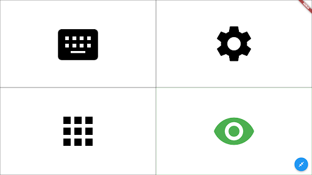
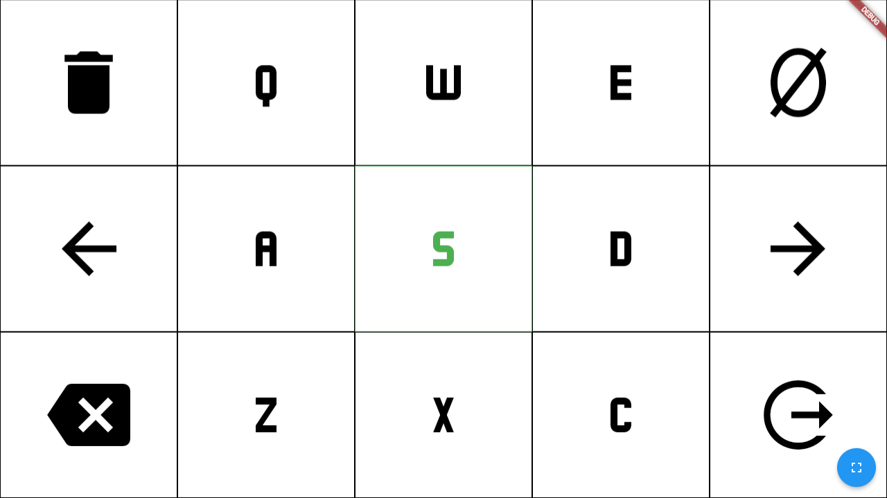
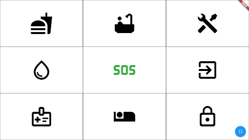
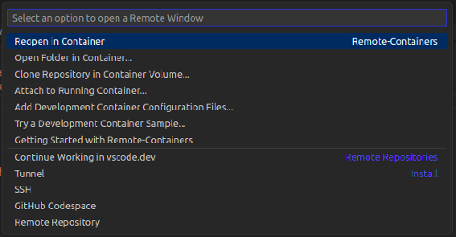
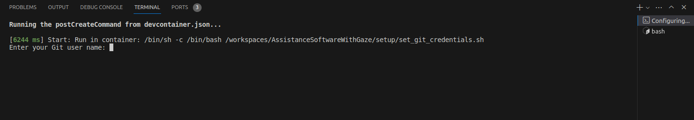
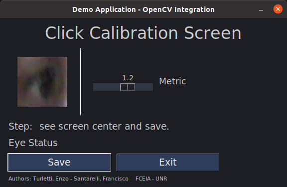
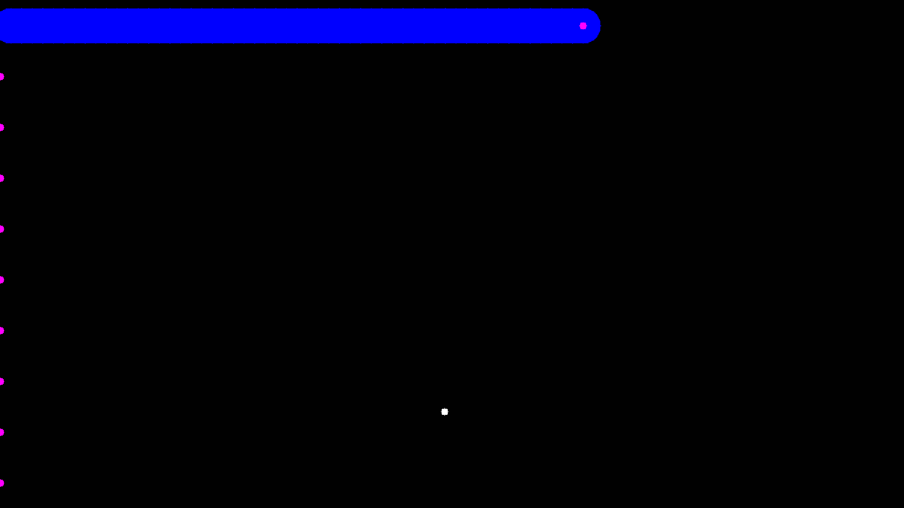
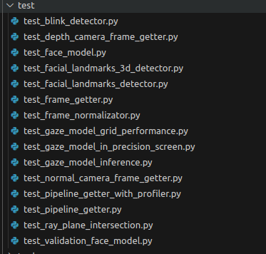

# Assistance Software with Gaze

<p align="center">
  
</p>

<p align="center">
  
</p>

<p align="center">
  
</p>


## Description

This repository contains a development Docker with a software tool for Notebook computers that allows people who use it to carry out basic communicative actions: writing on the screen and communicating needs through the basic use of sight, more specifically with their gaze. The theoretical background behind this project is this [documentation]( https://drive.google.com/file/d/1zWvhVu0elrEQMR7QTvGBvNv_nuOfBcPx/view?usp=drive_link).

With this repository you can:

1. Use a software application to communicate with your gaze.
2. Train the IA Model to estimate Gaze with a face photo.
3. Different tests to improve the result.

## Table of Contents

- [Requirements](#Requirements)
- [Installation](#Installation)
- [Run Application](#run-application)
- [Testing](#different-tests)
- [Configuration](#configuration)
- [Train your own model](#configuration-file)

## Requirements:

To use all the features of this repository (user application, testing tools, model training), we must have the following installed:

- Ubuntu 20.04
- Visual Studio Code
- Docker
- Remote Container Extension para Visual Studio Code

If we need to use only the user application it can work in Windows too. 

## Installation

1. Clone this repository:

```bash
git clone https://github.com/enzoturletti/AssistanceSoftwareWithGaze.git
```

2. Clone submodules:

```bash
cd AssistanceSoftwareWithGaze
git submodule update --init --recursive
```

3. Run setup script:

```bash
bash setup_project.sh
```

4. In Visual Studio Code, press `Ctrl+Shift+P` and find `Reopen in container` option: 

<p align="center">
  
</p>

6. Once the container is open, then, set Git credentials in the terminal.

<p align="center">
  
</p>

6. Configure the project in config.ini file. At the end, there is a [Configuration Section](#configuration-file) with an explanation about this file.

7. Run the following script and follow the instructions. 

```bash
bash run_click_calibration.sh
```

<p align="center">
  
</p>

8. Precision calibration. You should follow the purple point in the screen. This is optional, if you want to use you have to enable it in the config.ini file.

```bash
bash run_gaze_calibration.sh
```

<p align="center">
  
</p>

9. Enjoy. The project is ready to use.

## Run Application

1. Run the following script:

```bash
bash run.sh
```

2. Wait until Web Application is opened.

3. Enjoy.

## Different Tests

In this project, we have different scripts to test the entire application pipeline.

<p align="center">
  
</p>

1. To run this scripts, you have to run in the Visual Studio Code terminal using Python interpreter. For example, to test the precision in a grid:

```bash
python3 core/test/test_gaze_model_grid_performance.py
```
<p align="center">
  
</p>

## Train the model :

1. First, you should normalizate the dataset. In the root folder run the following script:

```bash
python3 train/run_preprocess.py
```

2. To train the model, you should run the following script in the root folder:

```bash
python3 train/run_train.py
```
If you want to change the training parameters you can do easily in the script.


## Configuration

1. Configuration file: in the root folder, there is a file called "config.ini". In this file, we have many available configurations.

```ini
[camera]
use_normal_camera = 1

; 1 - to use default camera in the Notebook.
; 0 - to use Intel Realsense SR305.
```

```ini
[paths]
camera_intrinsinc = /workspaces/AssistanceSoftwareWithGaze/core/data/camera_intrinsic.yaml
normalized_camera_intrinsic = /workspaces/AssistanceSoftwareWithGaze/core/data/normalized_camera_intrinsic.yaml
face_model = /workspaces/AssistanceSoftwareWithGaze/core/data/face_model.py
gaze_model = /workspaces/AssistanceSoftwareWithGaze/core/data/main_model.pth
camera_calibration = /workspaces/AssistanceSoftwareWithGaze/core/data/camera_calibration

; Paths to the different files used in the project and recommended not to modify.
```

```ini
[normalizated_camera]
normalizated_distance = 0.75
; This is the distance to the virtual camera. For more information, read the documentation PDF with the theorical information.
```

```ini
[screen_size]
aspect_ratio_horizontal = 16
aspect_ratio_vertical = 9
diagonal_size = 15.6
resolution_x = 1280 
resolution_y = 720
width_screen = 339
height_screen = 191
offset_camera = 10
; Configure your screen settings.
```

```ini
[calibration_screen]
use_user_gaze_calibration = 0 ; 
; 1 - Use data from calibration screen to improve precision. Should run calibration script before.
; 0 - Doesnt use data from calibration screen to improve precision.
```

```ini
[calibration_screen]
; Seconds between different rows in the calibration screen.
resting_time = 6 

; Circles number in test_gaze_model_in_precision_screen.py
number_of_circles = 10 

; Circles number in test_gaze_model_in_precision_screen.py
calibration_gaze_model_output = /workspaces/AssistanceSoftwareWithGaze/core/calibration_results/gaze_model_calibrations_results.txt
; Configure precision calibration screen.
```

```ini
[click_calibration]
click_calibration_path = /workspaces/AssistanceSoftwareWithGaze/core/calibration_results/
reference_open_eye_1 = /workspaces/AssistanceSoftwareWithGaze/core/calibration_results/open_eye_reference_1.png
reference_open_eye_2 = /workspaces/AssistanceSoftwareWithGaze/core/calibration_results/open_eye_reference_2.png
reference_open_eye_3 = /workspaces/AssistanceSoftwareWithGaze/core/calibration_results/open_eye_reference_3.png
reference_open_eye_4 = /workspaces/AssistanceSoftwareWithGaze/core/calibration_results/open_eye_reference_4.png
reference_open_eye_5 = /workspaces/AssistanceSoftwareWithGaze/core/calibration_results/open_eye_reference_5.png
reference_close_eye  = /workspaces/AssistanceSoftwareWithGaze/core/calibration_results/close_eye_reference.png
; Paths related to the click calibration.
```

```ini
[grid_screen]
grid_size = 5
; Configure testing grid size.
```

```ini
[demo]
allow_video_demostration = 0
; 1 - to capture video for testing screens.
; 0 - to not capture video for testing screens.
```